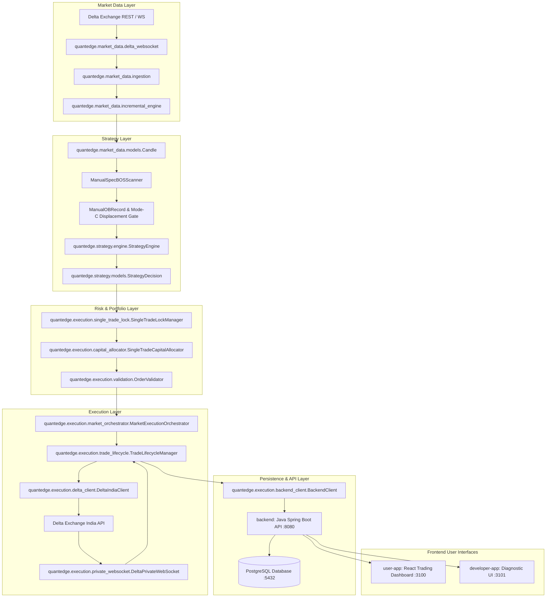

# QuantEdge AI Architecture & System Guide

**Status**: Authoritative Architecture Specification  
**Version**: 2.0.0

---

## 1. System Overview

QuantEdge AI is an automated, institutional-grade cryptocurrency trading platform designed for Delta Exchange India. The system is split across four core components:

```
┌─────────────────────────────────────────────────────────────────────────┐
│                             QuantEdge AI                                │
├──────────────┬──────────────┬──────────────┬────────────────────────────┤
│   React UI   │  Python Core │ Spring Boot  │         PostgreSQL         │
│  Dashboards  │    Engine    │   Backend    │          Database          │
│   (:3100)    │   (:8000)    │   (:8080)    │          (:5432)           │
└──────┬───────┴──────┬───────┴──────┬───────┴─────────────┬──────────────┘
       │              │              │                     │
       ▼              ▼              ▼                     ▼
Presentation    Market Data &   App Auth, Risk      Persistence &
(User/Dev App)  Strategy/SMC    & Delta Sync        State Reconciliation
```

---

## 2. Component Responsibilities

### 1. User Application (`/user-app`) — Port 3100
- React 18 + TypeScript + Vite trading dashboard.
- Real-time position monitoring, active orders, trade journal, PnL analytics.
- Communicates exclusively with Spring Boot REST API via `/api`.

### 2. Developer Application (`/developer-app`) — Port 3101
- Operator diagnostic & health monitoring interface.
- Real-time engine health, WebSocket telemetry, multi-user execution matrix, reconciliation logs.

### 3. Java Spring Boot Backend (`/backend`) — Port 8080
- Multi-tenant authentication (JWT, password resets, secure HttpOnly cookies).
- Account management, encrypted Delta API credential storage.
- Trade history, audit logs, and PostgreSQL database synchronization via JPA/Hibernate.

### 4. Python Trading Engine (`/engine`) — Port 8000
- **Market Data Pipeline** (`quantedge.market_data`):
  - Ingests Delta Exchange India 1H candles (REST history + live WebSocket streams).
  - Maintains deterministic, strictly causal incremental candle buffers.
- **Manual SMC Strategy Engine** (`quantedge.ai.research.displacement_gated_retest_engine` / `quantedge.strategy`):
  - `ManualSpecBOSScanner`: Causal BOS detection over sliding window of $N=10$ bars.
  - Mode C Displacement Gate: Probe $\rightarrow$ Pullback confirmation.
  - Order Geometry: Direction-specific (`origin.CLOSE` for SL), 25% depth entry, $+0.60\%$ fixed TP.
- **Execution & Risk Management** (`quantedge.execution`):
  - `SingleTradeLockManager`: Strict portfolio-wide 1-trade limit.
  - `SingleTradeCapitalAllocator`: Position sizing, 35% SL risk, leverage capping (up to 100x).
  - `DeltaIndiaClient`: Direct order placement, position management, and balance polling via HMAC SHA256 signed REST API.
  - `DeltaPrivateWebSocket`: Low-latency streaming of order status, fills, and position liquidation events.
  - `ExecutionReconciler`: Continuous state reconciliation against Delta Exchange and PostgreSQL.

### 5. PostgreSQL Database — Port 5432
- Authoritative relational store for users, accounts, trades, orders, and execution audit trails.

---

## 3. End-to-End Trading Flow



---

## 4. Claude Implementation Roadmap (Phase 2)

When integrating the Manual SMC strategy into full production:
1. **Target Strategy Package**:
   Implement `engine/src/quantedge/strategy/manual_smc/` (or clean `quantedge.strategy.engine` interface) using the exact logic validated in `ManualSpecBOSScanner`.
2. **Execution Wiring**:
   Connect signals emitted by the strategy to `quantedge.execution.market_orchestrator` and `quantedge.execution.trade_lifecycle`.
3. **Acceptance Verification**:
   Ensure `engine/tests/test_manual_smc_btc_acceptance.py` continuously passes **21/21** as the permanent regression guard.
4. **Reference Strategy Document**:
   Refer exclusively to [docs/MANUAL_SMC_STRATEGY.md](file:///c:/Users/durge/OneDrive/Desktop/Antigravity%20App/QuantEdge%20AI/docs/MANUAL_SMC_STRATEGY.md).