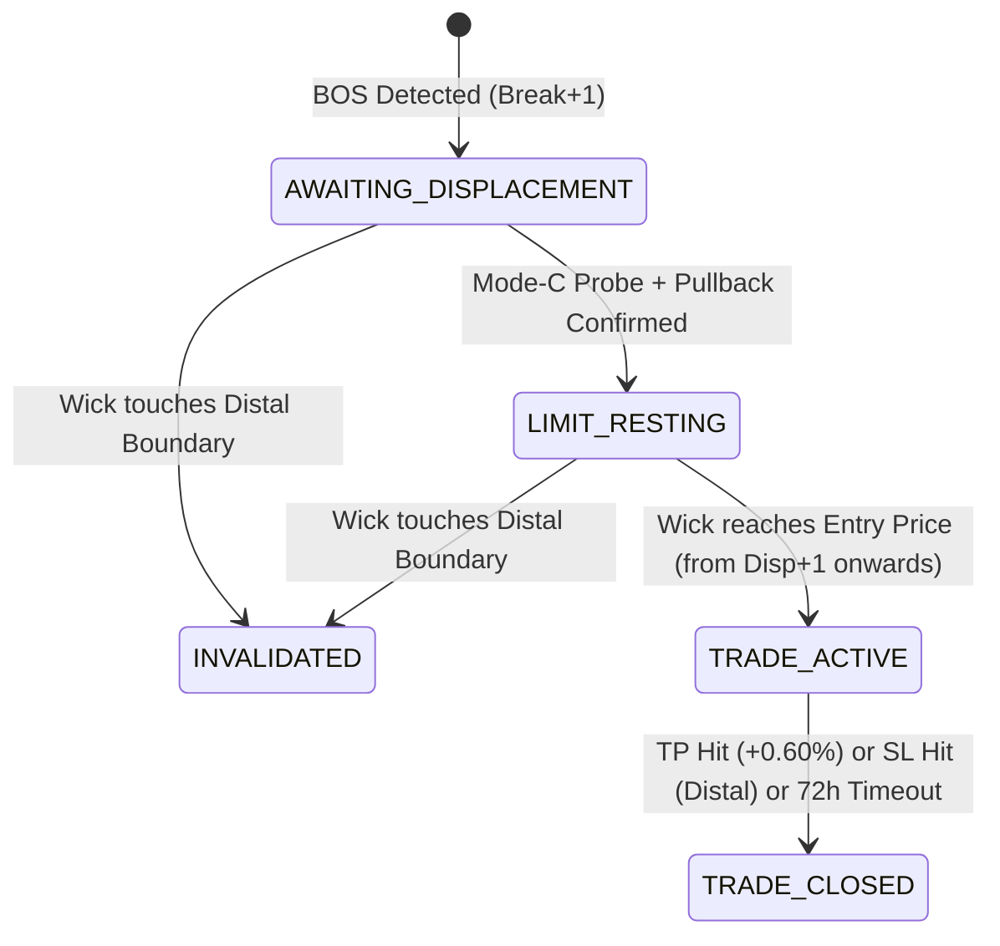

# Manual TradingView SMC Strategy Specification

**Status**: Authoritative Canonical Specification  
**Version**: 1.0.0 (Proven via Adversarial Forensic Investigation)  
**Reference Test**: `engine/tests/test_manual_smc_btc_acceptance.py` (21/21 Passing)

---

## 1. Overview & Strategy Principles

This document defines the **sole authoritative trading strategy specification** for QuantEdge AI. It represents the exact rules used in manual TradingView trading, proven candle-by-candle against the live market reference trade on BTCUSD.P (Bars 19577–19596).

### Core Invariants:
- **Strict Causality**: Zero lookahead bias. Decisions on bar $B$ rely exclusively on completed candles up to bar $B$.
- **Direction-Specific OB Boundaries**: Boundaries use the origin candle's `CLOSE` on the distal side, not the wick high/low.
- **Probe $\rightarrow$ Pullback Displacement (Mode C)**: Requires price to return into the OB (probe) and then exit back through the proximal boundary (pullback) before a limit order rests.
- **Wick-Based Invalidation**: Pre-entry invalidation occurs when price reaches the distal boundary with any wick touch.
- **Global Portfolio Lock**: Exactly one trade active at any time across all monitored assets.

---

## 2. Order Block Geometry

Order Blocks are identified at the moment of a Break of Structure (BOS). The origin candle is the **most recent opposing candle** within a lookback window of $N=10$ bars.

### Bearish Order Block (SHORT Setup)
Formed from the most recent **bullish** origin candle (`close > open`):
- **`ob_top` (Distal Boundary / Stop Loss)**: `origin.CLOSE` (*CRITICAL — NOT origin.HIGH*)
- **`ob_bottom` (Proximal Boundary)**: `origin.LOW`
- **`ob_width`**: `ob_top - ob_bottom`
- **Entry Level**: `ob_bottom + 0.25 * ob_width` (25% depth into OB from proximal)
- **Stop Loss (SL)**: `ob_top` (`origin.CLOSE`)
- **Take Profit (TP)**: `entry_price * (1.0 - 0.006)` (Fixed $+0.60\%$ move)

### Bullish Order Block (LONG Setup)
Formed from the most recent **bearish** origin candle (`close < open`):
- **`ob_top` (Proximal Boundary)**: `origin.HIGH`
- **`ob_bottom` (Distal Boundary / Stop Loss)**: `origin.CLOSE` (*CRITICAL — NOT origin.LOW*)
- **`ob_width`**: `ob_top - ob_bottom`
- **Entry Level**: `ob_top - 0.25 * ob_width` (25% depth into OB from proximal)
- **Stop Loss (SL)**: `ob_bottom` (`origin.CLOSE`)
- **Take Profit (TP)**: `entry_price * (1.0 + 0.006)` (Fixed $+0.60\%$ move)

---

## 3. Break of Structure (BOS) Detection

BOS is evaluated causal candle-by-candle:

1. **SHORT BOS**:
   - Condition: `current_candle.CLOSE < origin.LOW`
   - Trigger: Occurs on the close of the BOS candle.
2. **LONG BOS**:
   - Condition: `current_candle.CLOSE > origin.HIGH`
   - Trigger: Occurs on the close of the BOS candle.
3. **Deduplication**:
   - Each origin candle can only produce **one valid OB setup in history**. Once an origin index is consumed, subsequent closes beyond that level do not spawn duplicate OBs.
4. **Admission Timing**:
   - The newly detected OB is admitted to the live monitoring pool at **Break $+ 1$** (the bar immediately following the BOS candle close).

---

## 4. Mode C Displacement (Probe $\rightarrow$ Pullback)

Before a limit order is allowed to rest on the exchange, price must confirm displacement via a two-stage probe and pullback:

```
[Awaiting Displacement] ──(Close crosses into OB)──> [Probe Confirmed] ──(Close exits OB)──> [Limit Resting]
```

1. **Probe Confirmation**:
   - **SHORT**: Candle closes above proximal boundary (`close > ob_bottom`).
   - **LONG**: Candle closes below proximal boundary (`close < ob_top`).
2. **Pullback Confirmation (Displacement Event)**:
   - **SHORT**: Subsequent candle closes below proximal boundary (`close < ob_bottom`).
   - **LONG**: Subsequent candle closes above proximal boundary (`close > ob_top`).
3. **Execution Guard**:
   - The displacement confirmation candle **cannot trigger entry on the same bar**. The limit order becomes active starting on bar `displacement_bar + 1`.

---

## 5. Invalidation & Trade Lifecycle



- **Pre-Displacement Touches**: If price touches the 25% entry level before displacement confirmation, the touch is recorded as a diagnostic, but **no order is filled**.
- **Distal Invalidation**: If price wick reaches or exceeds the distal boundary (`high >= distal` for SHORT, `low <= distal` for LONG) at any point before entry fill, the OB is immediately killed (`INVALIDATED`).
- **Post-Entry Exit**:
  - **TP Hit**: Wick reaches `tp_price`.
  - **SL Hit**: Wick reaches `sl_price` (`origin.CLOSE`).
  - **Dual Touch In Same Candle**: Conservative resolution executes SL first.
  - **Holding Horizon**: Closed at market if not resolved within 72 bars.

---

## 6. Risk, Leverage & Position Sizing

- **Account Risk at SL**: $35.0\%$ of account balance.
- **Theoretical Leverage**: $\text{Theoretical Leverage} = \frac{35\%}{\text{SL Distance \%}}$
- **Applied Leverage**: $\min(100.0, \text{Theoretical Leverage})$
- **Fee Rate**: $0.08\%$ round-trip on position notional.
- **Global Lock**: Maximum of **1 active position** across all symbols at any point in time.

---

## 7. Golden BTC Reference Trade (Candle Ground Truth)

The engine's correctness is proven against the following 1H BTCUSD.P reference sequence:

| Bar Index | Event | OHLC Details | Strategy State & Values |
| :--- | :--- | :--- | :--- |
| **19577** | OB Origin (Bullish) | $O=79129.0, H=79239.0, L=78725.5, C=79210.5$ | $\text{Top}=79210.5, \text{Bottom}=78725.5, \text{Entry}=78846.75, \text{SL}=79210.5, \text{TP}=78373.67$ |
| **19580** | BOS Candle | $O=78894.5, H=78977.0, L=78046.5, C=78175.5$ | Close $78175.5 < 78725.5 \rightarrow$ SHORT OB created, state = `AWAITING_DISPLACEMENT` |
| **19581** | Post-BOS Bar | $O=78175.5, H=78643.5, L=77963.5, C=78544.0$ | Close $78544.0 < 78725.5 \rightarrow$ Probe NOT confirmed |
| **19582** | Probe Bar | $O=78544.0, H=78984.0, L=78520.5, C=78858.5$ | Close $78858.5 > 78725.5 \rightarrow$ Probe confirmed; High $78984 \ge 78846.75 \rightarrow$ Pre-touch counted (NO fill) |
| **19583** | Displacement Bar | $O=78858.5, H=78945.5, L=78425.0, C=78512.5$ | Close $78512.5 < 78725.5 \rightarrow$ Displacement Confirmed $\rightarrow$ `LIMIT_RESTING` (Active from bar 19584) |
| **19584** | Resting Limit Bar | $O=78512.5, H=78690.0, L=78318.5, C=78571.0$ | High $78690.0 < 78846.75 \rightarrow$ Limit resting, not filled |
| **19585** | Entry Fill Bar | $O=78571.0, H=78933.0, L=78497.5, C=78569.0$ | High $78933.0 \ge 78846.75 \rightarrow$ **ENTRY FILLED** (`TRADE_ACTIVE`) |
| **19586–19592** | Trade Active | Max High across window $= 79208.0 < 79210.5$ | SL is **NOT** breached |
| **19593** | Take Profit Exit | $O=78630.0, H=78858.0, L=78215.5, C=78336.0$ | Low $78215.5 \le 78373.67 \rightarrow$ **FILLED_TP** |

---

## 8. Multi-Asset Performance Baseline

Full backtest across canonical Delta Exchange India 1H history (2024–2026):

| Instrument | Executed Trades | Wins | Losses | Win Rate | Total Realized R | Profit Factor | Expectancy R |
| :--- | :--- | :--- | :--- | :--- | :--- | :--- | :--- |
| **BTCUSD** | 535 | 250 | 285 | 46.73% | +100.33 R | 1.35 | +0.188 R |
| **ETHUSD** | 499 | 300 | 199 | 60.12% | +159.57 R | 1.80 | +0.320 R |
| **SOLUSD** | 555 | 333 | 222 | 60.00% | +71.00 R | 1.32 | +0.128 R |
| **XRPUSD** | 433 | 270 | 163 | 62.36% | +131.09 R | 1.80 | +0.303 R |
| **TOTAL** | **2,022** | **1,153** | **869** | **57.02%** | **+461.99 R** | **1.56** | **+0.228 R** |
