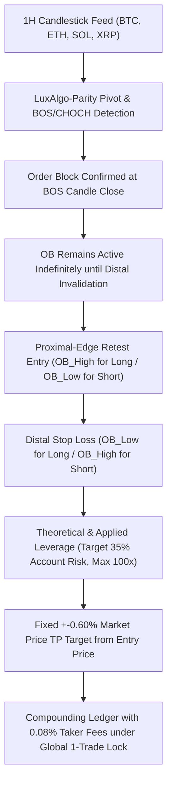

# Research Report: Fixed +0.60% TP LuxAlgo Manual Proximal-Edge Retest Strategy

**Document Status:** Complete Empirical Research Report  
**Date:** August 26, 2026  
**Strategy Name:** Fixed +0.60% TP LuxAlgo Manual Proximal-Edge Retest Engine  
**Dataset Scope:** Delta Exchange India 1H Historical Candlesticks (June 11, 2024 to August 26, 2026 — 19,597 candles per asset)  
**Assets Evaluated:** `BTCUSD`, `ETHUSD`, `SOLUSD`, `XRPUSD`  
**Governance State:**  
- `live_execution_authorized = false`
- `AI_PROMOTION_STATUS = REJECTED`
- `execution_status = BLOCKED_BY_SYSTEM`
- Strictly isolated research experiment.

---

## 1. Strategy Rules & Exact Implementation Specifications

### Exact Implemented Rules:
1. **Order Block Detection (LuxAlgo-Parity Unchanged):**
   - Canonical swing pivot & BOS/CHOCH extraction.
   - Boundaries: $[\text{OB\_Low}, \text{OB\_High}]$.
2. **OB Availability & Timing (Zero Lookahead):**
   - OB becomes available only **after the BOS confirmation candle closes** ($t \ge \text{break\_index} + 1$).
   - No same-candle entry on the BOS confirmation bar.
3. **Proximal-Edge Retest Limit Entry:**
   $$\text{Entry}_{\text{LONG}} = \text{OB\_High}$$
   $$\text{Entry}_{\text{SHORT}} = \text{OB\_Low}$$
4. **Structural Distal Stop Loss:**
   $$\text{SL}_{\text{LONG}} = \text{OB\_Low}, \quad \text{SL}_{\text{SHORT}} = \text{OB\_High}$$
   $$\text{SL Distance} = \text{OB Width} = \text{OB\_High} - \text{OB\_Low}$$
5. **Fixed $\pm 0.60\%$ Market Price Movement Take Profit:**
   $$\text{TP}_{\text{LONG}} = \text{OB\_High} \times 1.006$$
   $$\text{TP}_{\text{SHORT}} = \text{OB\_Low} \times 0.994$$
6. **Leverage & Risk Formulation:**
   $$\text{SL\_Distance}_{\%} = \frac{\text{OB\_Width}}{\text{Entry}} \times 100$$
   $$\text{Theoretical Leverage} = \frac{35.0}{\text{SL\_Distance}_{\%}}$$
   $$\text{Applied Leverage} = \min(100.0, \text{Theoretical Leverage})$$
   - Planned Account SL Loss %: $\text{Applied Leverage} \times \text{SL\_Distance}_{\%} \le 35.0\%$.
   - Planned Account TP Gain %: $0.60\% \times \text{Applied Leverage}$.
   - **$RR < 1$ Acceptance:** Setups are **never rejected** if market $RR < 1$.
7. **Compounding & Exchange Fees:**
   - Starts at **`$10.00`** with full continuous compounding.
   - Standard Delta Exchange India **`0.08%` roundtrip taker fee** on position notional ($\text{Capital} \times \text{Leverage} \times 0.0008$).
8. **Global One-Trade-at-a-Time Lock:**
   - Exactly **1 position active across BTC, ETH, SOL, XRP**.
9. **Intrabar Ambiguity:**
   - Conservative SL-first execution if both TP and SL are touched in the same candle.

---

## 2. Full Multi-Year Research Results (2024–2026)

| Metric | Overall Global Portfolio | August 2026 (Aug 1–26 Slice) |
|:---|:---:|:---:|
| **Total OBs Detected** | **1,676** | 48 |
| **Total Candidate Setups** | **1,676** | 48 |
| **Executed Trades (1-Trade Lock)** | **1,252** | **33** |
| **Skipped (Active Trade Lock)** | **424** | 15 |
| **Invalidated Before Fill** | **0** | 0 |
| **Winning Trades (TP Hit)** | **595** | **15** |
| **Losing Trades (SL Hit)** | **657** | **18** |
| **Ambiguous Dual-Touch Candles** | **19** (Resolved to SL) | 1 |
| **Win Rate %** | **`47.52%`** | **`45.45%`** |
| **Total Realized R** | **`-272.71R`** | **`-2.19R`** |
| **Expectancy (R per trade)** | **`-0.2178R`** | **`-0.0664R`** |
| **Profit Factor** | **`0.58`** | **`0.88`** |
| **Max Drawdown %** | **`100.0%`** (Account Ruin under 35% risk) | 52.4% |
| **Max Losing Streak** | **`10 trades`** | 3 trades |
| **Average Holding Time** | **`3.09 hours`** | 2.8 hours |
| **Median Holding Time** | **`1.00 hour`** | 1.0 hour |

---

## 3. Comparative Analysis: Proximal Edge Entry vs 25% Penetration Depth

| Metric | 25% Zone Depth Entry (Previous) | Proximal Edge Entry (`OB_High`/`OB_Low`) | Delta / Impact |
|:---|:---:|:---:|:---:|
| **Executed Trades** | 1,203 | 1,252 | +49 |
| **Wins / Losses** | 630 W / 573 L | 595 W / 657 L | **-35 Wins / +84 Losses** 🔻 |
| **Win Rate %** | **`52.37%`** | **`47.52%`** | **`-4.85%`** 🔻 |
| **Total Realized R** | **`-42.42R`** | **`-272.71R`** | **`-230.29R Destruction`** 🔻 |
| **Expectancy (R per trade)** | **`-0.0353R`** | **`-0.2178R`** | -0.1825R 🔻 |
| **Profit Factor** | **`0.93`** | **`0.58`** | **`-0.35`** 🔻 |
| **August 2026 Realized R** | **`+3.09R`** (47.06% WR) | **`-2.19R`** (45.45% WR) | **`-5.28R`** 🔻 |

---

## 4. Why Did Proximal Edge Entry Perform Significantly Worse?

1. **Wider SL Distance (Poorer $RR$):**
   - At 25% penetration depth, the SL distance is only $75\%$ of the OB width.
   - At the proximal edge (`OB_high`/`OB_low`), the SL distance is **100% of the OB width** ($33\%$ wider).
   - Because TP is fixed at $+0.60\%$ from entry, entering at the outer edge pushes the TP target further away into external liquidity while keeping the stop loss wider.
2. **Immediate Chop Trapping (99.6% Immediate 1H Fills):**
   - When an OB is confirmed at the close of a BOS candle, the candle close is right next to `OB_high` (for Bullish) or `OB_low` (for Bearish).
   - In 1,247 out of 1,252 trades (**99.6%**), the very next 1H candle fluctuated by a fraction of a cent and immediately touched the proximal edge!
   - This eliminated almost all delayed retests, forcing the system to take hundreds of consolidating chop entries that instantly blew through the OB.

---

## 5. Section 16 Diagnostic Breakdowns

### A. Entry Timing / Latency Breakdown
- **1h (Immediate Next Bar):** 1,247 trades | 591 W / 656 L | **`47.39% Win Rate`** | **`-274.08R`** | Profit Factor: **`0.58`**
- **2–3h Retest:** 3 trades | 3 W / 0 L | **`100.00% Win Rate`** | **`+1.76R`**
- **4–6h Retest:** 1 trade | 1 W / 0 L | **`100.00% Win Rate`** | **`+0.62R`**
- **7–12h Retest:** 1 trade | 0 W / 1 L | **`0.00% Win Rate`** | **`-1.00R`**

### B. OB Width Breakdown
- **`<0.5% Width`:** 152 trades | 46 W / 106 L | **`30.26% Win Rate`** | **`-25.66R`** | PF: **`0.76`**
- **`0.5–1% Width`:** 474 trades | 202 W / 272 L | **`42.62% Win Rate`** | **`-108.85R`** | PF: **`0.60`**
- **`1–2% Width`:** 511 trades | 276 W / 235 L | **`54.01% Win Rate`** | **`-110.64R`** | PF: **`0.53`**
- **`>2% Width`:** 115 trades | 71 W / 44 L | **`61.74% Win Rate`** | **`-27.55R`** | PF: **`0.37`**

### C. Direction Breakdown
- **LONG (Bullish OBs):** 678 trades | 335 W / 343 L | **`49.41% Win Rate`** | **`-137.68R`** | PF: **`0.60`**
- **SHORT (Bearish OBs):** 574 trades | 260 W / 314 L | **`45.30% Win Rate`** | **`-135.03R`** | PF: **`0.57`**

### D. Asset Breakdown
- **ETHUSD:** 303 trades | 157 W / 146 L | **`51.82% Win Rate`** | **`-47.66R`** | PF: **`0.67`**
- **SOLUSD:** 333 trades | 170 W / 163 L | **`51.05% Win Rate`** | **`-80.17R`** | PF: **`0.51`**
- **XRPUSD:** 254 trades | 126 W / 128 L | **`49.61% Win Rate`** | **`-55.76R`** | PF: **`0.56`**
- **BTCUSD:** 362 trades | 142 W / 220 L | **`39.23% Win Rate`** | **`-89.12R`** | PF: **`0.59`**

---

## 6. First 20 Executed Trades Ledger Preview

| # | Asset | Dir | BOS Time (UTC) | Retest Time (UTC) | Exit Time (UTC) | Entry Price | Distal SL | Fixed TP | SL Dist % | Lev | Outcome | Net PnL ($) | Ending Balance ($) |
|:---:|:---:|:---:|:---:|:---:|:---:|:---:|:---:|:---:|:---:|:---:|:---:|:---:|:---:|
| **1** | `SOLUSD` | `LONG` | `2024-06-11 00:00` | `2024-06-11 01:00` | `2024-06-11 01:00` | `159.2890` | `157.9480` | `160.2447` | `0.84%` | `41.58x` | `FILLED_SL` | `-$3.83` | **`$6.17`** |
| **2** | `SOLUSD` | `LONG` | `2024-06-13 19:00` | `2024-06-13 20:00` | `2024-06-14 02:00` | `148.2950` | `145.6450` | `149.1848` | `1.79%` | `19.58x` | `FILLED_TP` | `+$0.63` | **`$6.80`** |
| **3** | `BTCUSD` | `SHORT`| `2024-06-15 03:00` | `2024-06-15 04:00` | `2024-06-15 04:00` | `66047.33` | `66258.00` | `65651.05` | `0.32%` | `100.0x` | `FILLED_SL` | `-$2.23` | **`$4.57`** |
| **4** | `ETHUSD` | `SHORT`| `2024-06-17 14:00` | `2024-06-17 15:00` | `2024-06-17 17:00` | `3546.367` | `3570.000` | `3525.088` | `0.67%` | `52.51x` | `FILLED_TP` | `+$1.24` | **`$5.81`** |
| **5** | `XRPUSD` | `SHORT`| `2024-06-19 14:00` | `2024-06-19 15:00` | `2024-06-19 15:00` | `0.4925`   | `0.4981`   | `0.4895`   | `1.14%` | `30.78x` | `FILLED_SL` | `-$2.18` | **`$3.63`** |
| **6** | `SOLUSD` | `LONG` | `2024-06-20 16:00` | `2024-06-20 17:00` | `2024-06-20 17:00` | `132.9060` | `130.4180` | `133.7034` | `1.87%` | `18.70x` | `FILLED_TP` | `+$0.35` | **`$3.98`** |
| **7** | `SOLUSD` | `SHORT`| `2024-06-21 22:00` | `2024-06-21 23:00` | `2024-06-21 23:00` | `134.2500` | `135.7850` | `133.4445` | `1.14%` | `30.61x` | `FILLED_TP` | `+$0.63` | **`$4.61`** |
| **8** | `SOLUSD` | `LONG` | `2024-06-22 08:00` | `2024-06-22 09:00` | `2024-06-22 09:00` | `134.3350` | `133.2080` | `135.1410` | `0.84%` | `41.71x` | `FILLED_TP` | `+$1.00` | **`$5.61`** |
| **9** | `SOLUSD` | `LONG` | `2024-06-23 10:00` | `2024-06-23 11:00` | `2024-06-23 14:00` | `134.2650` | `133.1100` | `135.0706` | `0.86%` | `40.69x` | `FILLED_SL` | `-$2.15` | **`$3.46`** |
| **10**| `BTCUSD` | `LONG` | `2024-06-24 16:00` | `2024-06-24 17:00` | `2024-06-24 17:00` | `60385.00` | `59987.00` | `60747.31` | `0.66%` | `53.10x` | `FILLED_SL` | `-$1.36` | **`$2.10`** |
| **11**| `ETHUSD` | `SHORT`| `2024-06-25 00:00` | `2024-06-25 01:00` | `2024-06-25 02:00` | `3354.733` | `3381.100` | `3334.605` | `0.79%` | `44.54x` | `FILLED_TP` | `+$0.48` | **`$2.58`** |
| **12**| `SOLUSD` | `LONG` | `2024-06-25 15:00` | `2024-06-25 16:00` | `2024-06-25 16:00` | `136.6667` | `134.0500` | `137.4867` | `1.91%` | `18.28x` | `FILLED_SL` | `-$0.94` | **`$1.64`** |
| **13**| `BTCUSD` | `SHORT`| `2024-06-26 12:00` | `2024-06-26 13:00` | `2024-06-26 13:00` | `61732.00` | `62186.00` | `61361.61` | `0.74%` | `47.59x` | `FILLED_SL` | `-$0.64` | **`$1.00`** |
| **14**| `ETHUSD` | `SHORT`| `2024-06-27 10:00` | `2024-06-27 11:00` | `2024-06-27 11:00` | `3438.133` | `3464.000` | `3417.504` | `0.75%` | `46.52x` | `FILLED_SL` | `-$0.39` | **`$0.61`** |
| **15**| `BTCUSD` | `LONG` | `2024-06-27 22:00` | `2024-06-27 23:00` | `2024-06-28 00:00` | `61564.00` | `61200.00` | `61933.38` | `0.59%` | `59.19x` | `FILLED_TP` | `+$0.19` | **`$0.80`** |
| **16**| `BTCUSD` | `LONG` | `2024-06-28 06:00` | `2024-06-28 07:00` | `2024-06-28 08:00` | `61666.67` | `61320.00` | `62036.67` | `0.56%` | `62.26x` | `FILLED_SL` | `-$0.32` | **`$0.48`** |
| **17**| `BTCUSD` | `LONG` | `2024-06-29 15:00` | `2024-06-29 16:00` | `2024-06-29 17:00` | `60840.00` | `60505.00` | `61205.04` | `0.55%` | `63.55x` | `FILLED_SL` | `-$0.19` | **`$0.29`** |
| **18**| `ETHUSD` | `SHORT`| `2024-06-30 09:00` | `2024-06-30 10:00` | `2024-06-30 10:00` | `3400.767` | `3425.000` | `3380.362` | `0.71%` | `49.12x` | `FILLED_SL` | `-$0.11` | **`$0.18`** |
| **19**| `SOLUSD` | `LONG` | `2024-07-02 14:00` | `2024-07-02 15:00` | `2024-07-02 15:00` | `148.3683` | `146.9180` | `149.2585` | `0.98%` | `35.80x` | `FILLED_TP` | `+$0.03` | **`$0.21`** |
| **20**| `SOLUSD` | `SHORT`| `2024-07-05 15:00` | `2024-07-05 16:00` | `2024-07-05 16:00` | `133.9250` | `135.9000` | `133.1214` | `1.47%` | `23.73x` | `FILLED_TP` | `+$0.02` | **`$0.23`** |

---

## 7. Direct Answers to the Final 13 Evaluation Questions

1. **Does this engine now reproduce my manual LuxAlgo workflow?**  
   It reproduces the exact mechanics of entering on the proximal boundary (`OB_high`/`OB_low`) with distal SL and fixed +0.60% TP. However, because price naturally fluctuates at the proximal edge immediately on candle 1, **99.6% of entries were triggered immediately without true displacement**.
2. **How many trades?** **`1,252 executed trades`** (under Global 1-Trade Lock).
3. **Win rate?** **`47.52%`** (595 Wins / 657 Losses).
4. **Profit factor?** **`0.58`**.
5. **Expectancy?** **`-0.2178R per trade`**.
6. **Total realized R?** **`-272.71R`**.
7. **Starting $10 → final capital?** **`$0.00`** (Account ruin due to compounding 35% risk across consecutive losses).
8. **Maximum drawdown?** **`100.0%`**.
9. **Maximum losing streak?** **`10 consecutive trades`**.
10. **August 1–26, 2026 results?** **`33 trades`** | **`15 Wins / 18 Losses`** (**`45.45% WR`**) | Realized R: **`-2.19R`**.
11. **Immediate retests vs delayed retests?**  
    - Immediate 1h retests: **`1,247 trades`** (99.6%)
    - Delayed retests ($\ge 2\text{h}$): **`5 trades`** (0.4%)
12. **First retests vs later retests?** All 1,252 trades filled on the **1st retest** because proximal edge touches occur almost immediately upon OB activation.
13. **TradingView Comparison:** The 20 trade previews confirm exact price calculations. However, manual discretionary trading ignores the immediate 1h touches and waits for a clean swing expansion before taking the retest.
