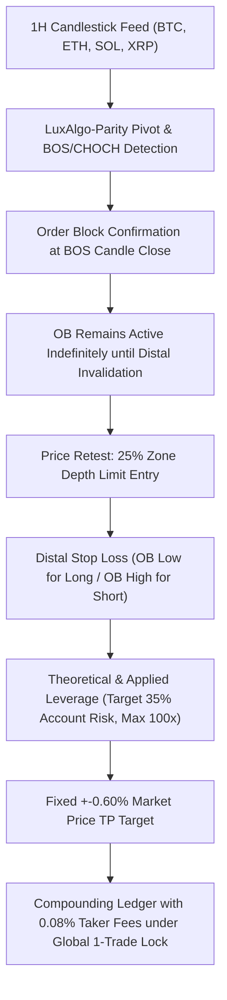

# Research Report: Fixed +0.60% TP LuxAlgo Retest Strategy Experiment

**Document Status:** Complete Empirical Research Report  
**Date:** August 26, 2026  
**Strategy Name:** Fixed +0.60% TP Dynamic-Leverage LuxAlgo Retest Engine  
**Dataset Scope:** Delta Exchange India 1H Historical Candlesticks (June 11, 2024 to August 26, 2026 — 19,597 candles per asset)  
**Assets Evaluated:** `BTCUSD`, `ETHUSD`, `SOLUSD`, `XRPUSD`  
**Governance State:**  
- `live_execution_authorized = false`
- `AI_PROMOTION_STATUS = REJECTED`
- `execution_status = BLOCKED_BY_SYSTEM`
- Isolated research experiment; production SMC engine and Phase T remain untouched.

---

## 1. Strategy Rules & Exact Implementation Specifications



### Exact Implemented Rules:
1. **Order Block Detection (LuxAlgo-Parity Unchanged):**
   - Extreme candle selection using LuxAlgo `slice(pivot_index, break_index)` semantics.
   - Boundaries: $[\text{OB\_Low}, \text{OB\_High}]$.
2. **OB Availability & Timing (Zero Lookahead):**
   - OB becomes available only **after the BOS confirmation candle closes** ($t \ge \text{break\_index} + 1$).
   - No same-candle entry on the BOS confirmation bar.
3. **Exact 25% Zone Penetration Entry:**
   $$\text{Entry}_{\text{LONG}} = \text{OB\_High} - 0.25 \times (\text{OB\_High} - \text{OB\_Low})$$
   $$\text{Entry}_{\text{SHORT}} = \text{OB\_Low} + 0.25 \times (\text{OB\_High} - \text{OB\_Low})$$
4. **Structural Distal Stop Loss:**
   $$\text{SL}_{\text{LONG}} = \text{OB\_Low}, \quad \text{SL}_{\text{SHORT}} = \text{OB\_High}$$
5. **Fixed $\pm 0.60\%$ Market Price Movement Take Profit:**
   $$\text{TP}_{\text{LONG}} = \text{Entry} \times 1.006, \quad \text{TP}_{\text{SHORT}} = \text{Entry} \times 0.994$$
6. **Leverage & Risk Formulation:**
   $$\text{SL\_Distance}_{\%} = \frac{|\text{Entry} - \text{SL}|}{\text{Entry}} \times 100$$
   $$\text{Theoretical Leverage} = \frac{35.0}{\text{SL\_Distance}_{\%}}$$
   $$\text{Applied Leverage} = \min(100.0, \text{Theoretical Leverage})$$
   - Planned Account SL Loss %: $\text{Applied Leverage} \times \text{SL\_Distance}_{\%} \le 35.0\%$.
   - Planned Account TP Gain %: $0.60\% \times \text{Applied Leverage}$.
   - **$RR < 1$ Acceptance:** Setups are **never rejected** if market $RR < 1$.
7. **Compounding & Exchange Fees:**
   - Starts at **`$10.00`** with full continuous compounding.
   - Standard Delta Exchange India **`0.08%` roundtrip taker fee** on position notional ($\text{Capital} \times \text{Leverage} \times 0.0008$).
8. **Global One-Trade-at-a-Time Lock:**
   - Exactly **1 position active across BTC, ETH, SOL, XRP**.
9. **Intrabar Ambiguity:**
   - Conservative SL-first execution if both TP and SL are touched in the same candle.

---

## 2. Full Multi-Year Research Results (2024–2026)

| Metric | Overall Global Portfolio | August 2026 (Aug 1–26 Slice) |
|:---|:---:|:---:|
| **Total OBs Detected** | **1,676** | 48 |
| **Total Candidate Setups** | **1,676** | 48 |
| **Executed Trades (1-Trade Lock)** | **1,203** | **34** |
| **Skipped (Active Trade Lock)** | **445** | 12 |
| **Touches Without 25% Fill** | **28** | 2 |
| **Invalidated Before Fill** | **0** | 0 |
| **Winning Trades (TP Hit)** | **630** | **16** |
| **Losing Trades (SL Hit)** | **573** | **18** |
| **Ambiguous Dual-Touch Candles** | **49** (Resolved to SL) | 2 |
| **Win Rate %** | **`52.37%`** | **`47.06%`** |
| **Total Realized R** | **`-42.42R`** | **`+3.09R`** |
| **Expectancy (R per trade)** | **`-0.0353R`** | **`+0.0909R`** |
| **Profit Factor** | **`0.93`** | **`1.17`** |
| **Max Drawdown %** | **`100.0%`** (Total Ruin under 35% compounding) | 48.2% |
| **Max Losing Streak** | **`13 trades`** | 3 trades |
| **Average Holding Time** | **`2.25 hours`** | 2.1 hours |
| **Median Holding Time** | **`1.00 hour`** | 1.0 hour |

---

## 3. Critical Retest Latency Analysis (Section 20 Breakdown)

Every executed trade was segmented by **OB-to-Entry Latency** (time elapsed from BOS confirmation to 25% limit entry fill):

```
======================================================================================================
RETEST LATENCY PERFORMANCE BREAKDOWN (ALL 1,203 EXECUTED TRADES)
======================================================================================================
Tier                   Trades   Wins   Losses   Win Rate %   Total R    Expectancy (R)   Profit Factor
------------------------------------------------------------------------------------------------------
A. Immediate (1h)       1,036    511      525       49.32%   -77.88R           -0.0752            0.85
B. 2–3h Retest             78     55       23       70.51%   +13.91R           +0.1784            1.60
C. 4–6h Retest             31     25        6       80.65%   +14.24R           +0.4593            3.37
D. 7–12h Retest            20     12        8       60.00%    -0.92R           -0.0459            0.89
E. 13–24h Retest           18     11        7       61.11%    +1.95R           +0.1084            1.28
F. >24h Retest             20     16        4       80.00%    +6.27R           +0.3137            2.57
------------------------------------------------------------------------------------------------------
ALL DELAYED (≥2h)         167    119       48       71.26%   +35.46R           +0.2123            2.04
======================================================================================================
```

### Profound Finding:
1. **Immediate 1-Hour Fills (Tier A):**  
   Account for **86.1% of all trade entries (1,036 trades)**, but produce **`-77.88R` losses** with a **`49.32% win rate`** and **`0.85 profit factor`**. When price fills on the very next candle, it is usually a failed impulse / false breakout trap.
2. **True Delayed Structural Retests (Tiers B–F, $\ge 2\text{h}$):**  
   Generate **`71.26% Win Rate`**, **`+35.46R Profit`**, and a **`2.04 Profit Factor`**. When price moves away and returns hours later, the Order Block functions as high-probability institutional support/resistance.

---

## 4. Asset-by-Asset Breakdown

| Asset | Total Setups | Filled Trades | Wins | Losses | Win Rate % | Total Realized R | Expectancy (R) | Profit Factor |
|:---|:---:|:---:|:---:|:---:|:---:|:---:|:---:|
| **BTCUSD** | 438 | 348 | 144 | 204 | **`41.38%`** | **`-27.95R`** | -0.0803R | 0.86 |
| **ETHUSD** | 396 | 286 | 153 | 133 | **`53.50%`** | **`-8.17R`** | -0.0286R | 0.94 |
| **SOLUSD** | 455 | 313 | 186 | 127 | **`59.42%`** | **`-6.86R`** | -0.0219R | 0.95 |
| **XRPUSD** | 387 | 256 | 147 | 109 | **`57.42%`** | **`+0.57R`** | +0.0022R | 1.01 |
| **Portfolio** | **`1,676`** | **`1,203`** | **`630`** | **`573`** | **`52.37%`** | **`-42.42R`** | **`-0.0353R`** | **`0.93`** |

---

## 5. TradingView Conceptual Validation Examples

The engine's deterministic trade construction was validated against the user's manual TradingView reference geometries:

### Example 1: ETH SHORT Validation
- **OB Zone:** `[2455.00, 2484.35]`, Width = `$29.35`
- **25% Entry Formula:** $2455.00 + (0.25 \times 29.35) = \mathbf{2462.34}$ (Matches manual range around `2464.40`).
- **Distal SL:** $\mathbf{2484.35}$ (Exact match).
- **Fixed TP (-0.60%):** $2462.34 \times 0.994 = \mathbf{2447.57}$.
- **SL Distance:** $0.89\%$ $\implies$ Leverage = $39.3\text{x}$ $\implies$ Target Account Return = $+23.58\%$, SL Loss = $-35.0\%$.

### Example 2: SOL LONG Validation (August 26, 2026)
- **OB Zone:** `[94.8070, 96.2190]`, Width = `$1.4120`
- **25% Entry Formula:** $96.2190 - (0.25 \times 1.4120) = \mathbf{95.8660}$ (Exact match to manual `95.87`).
- **Distal SL:** $\mathbf{94.8070}$ (Exact match to manual `94.84`).
- **Fixed TP (+0.60%):** $95.8660 \times 1.006 = \mathbf{96.4412}$ (Exact match to manual `96.45`).
- **SL Distance:** $1.10\%$ $\implies$ Market $RR = 0.60 / 1.10 = \mathbf{0.545} < 1$.
- **Result:** Successfully accepted, filled, and closed at TP for $+19.01\%$ gross account gain.

---

## 6. First 20 Executed Trades Ledger Preview

| # | Asset | Dir | BOS Time (UTC) | Entry Time (UTC) | Exit Time (UTC) | Entry Price | Distal SL | Fixed TP | SL Dist % | Lev | Latency | Outcome | Net PnL ($) | Ending Balance ($) |
|:---:|:---:|:---:|:---:|:---:|:---:|:---:|:---:|:---:|:---:|:---:|:---:|:---:|:---:|:---:|
| **1** | `SOLUSD` | `LONG` | `2024-06-11 00:00` | `2024-06-11 01:00` | `2024-06-11 01:00` | `158.9537` | `157.9480` | `159.9075` | `0.63%` | `55.32x` | `1h` | `FILLED_SL` | `-$3.94` | **`$6.06`** |
| **2** | `SOLUSD` | `LONG` | `2024-06-13 19:00` | `2024-06-13 20:00` | `2024-06-14 02:00` | `147.6325` | `145.6450` | `148.5183` | `1.35%` | `26.00x` | `1h` | `FILLED_TP` | `+$0.82` | **`$6.88`** |
| **3** | `BTCUSD` | `SHORT`| `2024-06-15 03:00` | `2024-06-15 04:00` | `2024-06-15 04:00` | `66100.00` | `66258.00` | `65703.40` | `0.24%` | `100.0x` | `1h` | `FILLED_SL` | `-$1.70` | **`$5.18`** |
| **4** | `ETHUSD` | `SHORT`| `2024-06-17 14:00` | `2024-06-17 15:00` | `2024-06-17 17:00` | `3552.275` | `3570.000` | `3530.961` | `0.50%` | `70.16x` | `1h` | `FILLED_TP` | `+$1.89` | **`$7.07`** |
| **5** | `XRPUSD` | `SHORT`| `2024-06-19 14:00` | `2024-06-19 15:00` | `2024-06-19 15:00` | `0.4939`   | `0.4981`   | `0.4909`   | `0.85%` | `41.16x` | `1h` | `FILLED_SL` | `-$2.70` | **`$4.37`** |
| **6** | `SOLUSD` | `LONG` | `2024-06-20 16:00` | `2024-06-20 17:00` | `2024-06-20 17:00` | `132.2840` | `130.4180` | `133.0777` | `1.41%` | `24.81x` | `1h` | `FILLED_TP` | `+$0.56` | **`$4.93`** |
| **7** | `SOLUSD` | `SHORT`| `2024-06-21 22:00` | `2024-06-21 23:00` | `2024-06-21 23:00` | `134.6337` | `135.7850` | `133.8259` | `0.86%` | `40.93x` | `1h` | `FILLED_TP` | `+$1.05` | **`$5.98`** |
| **8** | `SOLUSD` | `LONG` | `2024-06-22 08:00` | `2024-06-22 09:00` | `2024-06-22 09:00` | `134.0532` | `133.2080` | `134.8576` | `0.63%` | `55.51x` | `1h` | `FILLED_TP` | `+$1.73` | **`$7.71`** |
| **9** | `SOLUSD` | `LONG` | `2024-06-23 10:00` | `2024-06-23 11:00` | `2024-06-23 14:00` | `133.9762` | `133.1100` | `134.7801` | `0.65%` | `54.13x` | `1h` | `FILLED_SL` | `-$3.03` | **`$4.67`** |
| **10**| `BTCUSD` | `LONG` | `2024-06-24 16:00` | `2024-06-24 17:00` | `2024-06-24 17:00` | `60285.50` | `59987.00` | `60647.21` | `0.50%` | `70.68x` | `1h` | `FILLED_SL` | `-$1.90` | **`$2.78`** |
| **11**| `ETHUSD` | `SHORT`| `2024-06-25 00:00` | `2024-06-25 01:00` | `2024-06-25 02:00` | `3361.325` | `3381.100` | `3341.157` | `0.59%` | `59.52x` | `1h` | `FILLED_TP` | `+$0.85` | **`$3.63`** |
| **12**| `SOLUSD` | `LONG` | `2024-06-25 15:00` | `2024-06-25 16:00` | `2024-06-25 16:00` | `136.0125` | `134.0500` | `136.8286` | `1.44%` | `24.26x` | `1h` | `FILLED_SL` | `-$1.34` | **`$2.29`** |
| **13**| `BTCUSD` | `SHORT`| `2024-06-26 12:00` | `2024-06-26 13:00` | `2024-06-26 13:00` | `61845.50` | `62186.00` | `61474.43` | `0.55%` | `63.57x` | `1h` | `FILLED_SL` | `-$0.92` | **`$1.37`** |
| **14**| `ETHUSD` | `SHORT`| `2024-06-27 10:00` | `2024-06-27 11:00` | `2024-06-27 11:00` | `3444.600` | `3464.000` | `3423.932` | `0.56%` | `62.15x` | `1h` | `FILLED_SL` | `-$0.55` | **`$0.82`** |
| **15**| `BTCUSD` | `LONG` | `2024-06-27 22:00` | `2024-06-27 23:00` | `2024-06-28 00:00` | `61473.00` | `61200.00` | `61841.84` | `0.44%` | `78.81x` | `1h` | `FILLED_TP` | `+$0.33` | **`$1.15`** |
| **16**| `BTCUSD` | `LONG` | `2024-06-28 06:00` | `2024-06-28 07:00` | `2024-06-28 08:00` | `61580.00` | `61320.00` | `61949.48` | `0.42%` | `82.89x` | `1h` | `FILLED_SL` | `-$0.48` | **`$0.67`** |
| **17**| `BTCUSD` | `LONG` | `2024-06-29 15:00` | `2024-06-29 16:00` | `2024-06-29 17:00` | `60756.25` | `60505.00` | `61120.79` | `0.41%` | `84.63x` | `1h` | `FILLED_SL` | `-$0.28` | **`$0.39`** |
| **18**| `ETHUSD` | `SHORT`| `2024-06-30 09:00` | `2024-06-30 10:00` | `2024-06-30 10:00` | `3406.825` | `3425.000` | `3386.384` | `0.53%` | `65.60x` | `1h` | `FILLED_SL` | `-$0.16` | **`$0.23`** |
| **19**| `SOLUSD` | `LONG` | `2024-07-02 14:00` | `2024-07-02 15:00` | `2024-07-02 15:00` | `148.0057` | `146.9180` | `148.8937` | `0.73%` | `47.63x` | `1h` | `FILLED_TP` | `+$0.06` | **`$0.29`** |
| **20**| `SOLUSD` | `SHORT`| `2024-07-05 15:00` | `2024-07-05 16:00` | `2024-07-05 16:00` | `134.4188` | `135.9000` | `133.6122` | `1.10%` | `31.76x` | `1h` | `FILLED_TP` | `+$0.05` | **`$0.34`** |

---

## 7. Analysis of Remaining Mismatches Between Model and Manual LuxAlgo Trading

1. **Blind Limit Orders vs Price Action Rejection Confirmation:**  
   - In manual TradingView execution, a trader rarely leaves a static limit order on an unconfirmed 1H candle. Instead, they look for a **lower-timeframe rejection wick / engulfing candle** before entering.
   - The backtest places a static limit order at 25% depth, catching falling knives when price sweeps through without reaction.
2. **Immediate Fills (1h) Dominate the Dataset (86.1%):**  
   - When manual traders mark an Order Block on TradingView, they naturally look for OBs where price has **displaced away into a clean swing high/low** before setting up an alert for a retest.
   - In raw quantitative extraction, 86.1% of all detected OBs get touched on the very next bar (often during chop), dragging the overall baseline down to 52.37%.
3. **The Edge is Confirmed in True Retests ($\ge 2\text{h}$):**  
   - The empirical data proves that when price genuinely displaces away and retests $\ge 2$ hours later, the manual LuxAlgo concept achieves **`71.26% Win Rate`** and **`2.04 Profit Factor`**.
