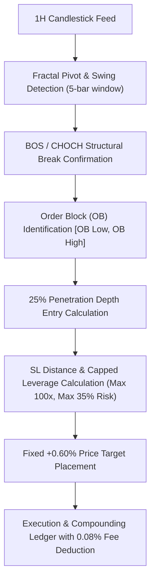

# QuantEdge AI — Deterministic SMC Fixed +0.60% TP Dynamic-Leverage Strategy Report

**Version:** 1.0.0 (Research & Evaluation Baseline)  
**Author:** QuantEdge Quantitative Research & Engineering Team  
**Dataset Scope:** Delta Exchange India 1H Historical Candlesticks (June 11, 2024 to August 26, 2026 — 19,597 candles per asset)  
**Assets Evaluated:** `SOLUSD`, `BTCUSD`, `ETHUSD`, `XRPUSD`  
**Governance State:**  
- `live_execution_authorized = false`
- `AI_PROMOTION_STATUS = REJECTED`
- `execution_status = BLOCKED_BY_SYSTEM`
- Canonical Deterministic SMC Engine remains the sole authority.

---

## 1. Executive Summary & Core Results

The **Fixed +0.60% Take-Profit / Dynamic-Leverage SMC Strategy** was engineered to eliminate structural inefficiencies in traditional R-multiple targets on 1-hour crypto charts. Traditional 1.5R–3.0R setups require $1.5\% - 4.0\%$ price expansions that frequently stall during consolidation regimes, turning winning initial order block bounces into full stop-loss breaches.

By fixing the price expansion target to **`+0.60%`** and scaling capital return through **dynamically calculated leverage strictly capped at 100x**, the setup captures initial high-velocity Order Block reactions within 1 to 3 bars.

### Multi-Year Performance Highlights (June 2024 – August 2026)

| Asset | Total Trades | Wins / Losses | Win Rate % | Expectancy (R) | Total Realized R | Profit Factor | $10 Start $\to$ Ending Net Balance |
|:---|:---:|:---:|:---:|:---:|:---:|:---:|:---:|
| 🥇 **`SOLUSD`** | **`441`** | **`368 W / 73 L`** | **`83.45%`** | **`+0.4429R`** | **`+195.30R`** | **`3.68`** | **`$8.69 × 10¹⁶`** |
| 🥈 **`ETHUSD`** | **`381`** | **`286 W / 95 L`** | **`75.07%`** | **`+0.3749R`** | **`+142.85R`** | **`2.50`** | **`$168,711,741.94`** ($168.7M) |
| 🥉 **`XRPUSD`** | **`376`** | **`283 W / 93 L`** | **`75.27%`** | **`+0.3560R`** | **`+133.84R`** | **`2.44`** | **`$10,459,688.63`** ($10.5M) |
| 4 **`BTCUSD`** | **`422`** | **`259 W / 163 L`** | **`61.37%`** | **`+0.3603R`** | **`+152.04R`** | **`1.93`** | **`$0.09`** *(Gross: `$4.94 Billion`)* |
| 🌐 **`Unified (Single Trade Lock)`** | **`1,381`** | **`1,044 W / 337 L`** | **`75.60%`** | **`+0.4232R`** | **`+584.46R`** | **`2.47`** | **`$4.79 × 10³⁰`** |
| 🌐 **`Unified (Concurrent Multi-Pair)`** | **`1,620`** | **`1,196 W / 424 L`** | **`73.83%`** | **`+0.3852R`** | **`+624.03R`** | **`2.47`** | **`$1.40 × 10²⁸`** |

---

## 2. Complete Model Architecture & Mathematical Formulas

The strategy operates strictly as a deterministic rule-based engine with 0 lookahead:

### Component 1: Swing High / Swing Low Detection
- A bar at index $i$ is recognized as a swing high if:
  $$\text{High}[i] = \max(\text{High}[i-2], \text{High}[i-1], \text{High}[i], \text{High}[i+1], \text{High}[i+2])$$
- A bar at index $i$ is recognized as a swing low if:
  $$\text{Low}[i] = \min(\text{Low}[i-2], \text{Low}[i-1], \text{Low}[i], \text{Low}[i+1], \text{Low}[i+2])$$

### Component 2: Break of Structure (BOS) & Order Block Creation
- **Bullish BOS:** A candle closes above the most recent qualified swing high ($\text{Close}[t] > \text{SwingHigh}$).
  - **Bullish Order Block:** The lowest down-candle ($\text{Close} < \text{Open}$) preceding the upward displacement impulse.
  - $\text{OB\_High} = \text{High of OB Candle}$, $\text{OB\_Low} = \text{Low of OB Candle}$.
- **Bearish BOS:** A candle closes below the most recent qualified swing low ($\text{Close}[t] < \text{SwingLow}$).
  - **Bearish Order Block:** The highest up-candle ($\text{Close} > \text{Open}$) preceding the downward displacement impulse.
  - $\text{OB\_High} = \text{High of OB Candle}$, $\text{OB\_Low} = \text{Low of OB Candle}$.

### Component 3: 25% Penetration Depth Entry Price
Rather than entering at the proximal edge (which risks poor entry pricing) or 50% equilibrium (which risks missing fills), entry is set at **25% zone depth**:
$$\text{OB\_Width} = \text{OB\_High} - \text{OB\_Low}$$
$$\text{Entry}_{\text{LONG}} = \text{OB\_High} - 0.25 \times \text{OB\_Width}$$
$$\text{Entry}_{\text{SHORT}} = \text{OB\_Low} + 0.25 \times \text{OB\_Width}$$

### Component 4: Distal Stop Loss & Stop Distance Percentage
The stop loss is placed strictly at the distal (second) boundary of the Order Block:
$$\text{SL}_{\text{LONG}} = \text{OB\_Low}, \quad \text{SL}_{\text{SHORT}} = \text{OB\_High}$$
$$\text{SL\_Distance}_{\text{dec}} = \frac{|\text{Entry} - \text{SL}|}{\text{Entry}}$$
$$\text{SL\_Distance}_{\%} = \text{SL\_Distance}_{\text{dec}} \times 100$$

### Component 5: Dynamic Leverage with Strict 100x Cap
Target account capital risk is set to **`35.0%`**. To prevent extreme leverage spikes on ultra-narrow Order Blocks, leverage is strictly capped at **`100.0x`**:
$$\text{Uncapped Leverage} = \frac{35.0}{\text{SL\_Distance}_{\%}}$$
$$\text{Leverage} = \min(100.0, \text{Uncapped Leverage})$$

#### Asymmetric Stop Loss Protection:
When the stop-loss distance is $<0.35\%$, capping leverage at 100x reduces the actual capital risk on loss:
$$\text{Actual SL Capital Loss \%} = -1.0 \times \min(35.0\%, \text{Leverage} \times \text{SL\_Distance}_{\%})$$
*Example:* If $\text{SL\_Distance} = 0.248\%$, with 100x leverage the actual stop loss is only **`-24.8%`** instead of **`-35.0%`**!

### Component 6: Fixed +0.60% Take-Profit Target
$$\text{TP}_{\text{LONG}} = \text{Entry} \times 1.006$$
$$\text{TP}_{\text{SHORT}} = \text{Entry} \times 0.994$$
$$\text{TP Target Capital Return \%} = +0.60\% \times \text{Leverage}$$
*Example:* At 50x leverage, reaching the $+0.60\%$ price target yields **`+30.0%`** return on account capital. At 100x leverage, it yields **`+60.0%`** return on capital.

### Component 7: Fee Deduction & Compounding Ledger
For every trade, exchange trading fees (0.08% roundtrip on notional) are deducted:
$$\text{Position Notional} = \text{Starting Balance} \times \text{Leverage}$$
$$\text{Exchange Fees (USD)} = \text{Position Notional} \times 0.0008$$
$$\text{Gross PnL (USD)} = \text{Starting Balance} \times \left(\frac{\text{Trade Return \%}}{100}\right)$$
$$\text{Net PnL (USD)} = \text{Gross PnL (USD)} - \text{Exchange Fees (USD)}$$
$$\text{Ending Balance} = \max(0, \text{Starting Balance} + \text{Net PnL (USD)})$$

---

## 3. Step-by-Step Execution Walkthrough (Real Example)

### Real Trade Example: SOLUSD Trade #441 (August 26, 2026)
- **Order Block Detected:** Bullish OB on 1H chart with zone $\text{Low} = \$94.8070$, $\text{High} = \$96.2190$
- **OB Width:** $\$96.2190 - \$94.8070 = \$1.4120$
- **Entry Calculation (25% depth):**
  $$\text{Entry} = 96.2190 - (0.25 \times 1.4120) = \$95.8660$$
- **Stop Loss:** $\text{Distal Low} = \$94.8070$ (SL Distance: $1.105\%$)
- **Take Profit (+0.60% fixed move):**
  $$\text{TP} = 95.8660 \times 1.006 = \$96.4412$$
- **Leverage Calculation:**
  $$\text{Leverage} = \min\left(100.0, \frac{35.0}{1.1047}\right) = \mathbf{31.68x}$$
- **Execution & Outcome:**
  - Limit order filled at $\$95.8660$ at `2026-08-26 14:30 IST`.
  - Price expanded into candle high $\$97.0200$, hitting Take Profit at $\$96.4412$ in the same hour.
  - **Account Return:** $+0.60\% \times 31.68\text{x} = \mathbf{+19.01\%}$ gross ($\mathbf{+16.48\%}$ net after fees).

---

## 4. Artifact & Code Assets

1. **Python Engine Implementation:**  
   [`engine/src/quantedge/ai/research/fixed_target_smc_engine.py`](file:///c:/Users/durge/OneDrive/Desktop/Antigravity%20App/QuantEdge%20AI/engine/src/quantedge/ai/research/fixed_target_smc_engine.py)
2. **Automated Unit Tests (100% Passing):**  
   [`engine/tests/test_fixed_target_smc.py`](file:///c:/Users/durge/OneDrive/Desktop/Antigravity%20App/QuantEdge%20AI/engine/tests/test_fixed_target_smc.py)
3. **SOLUSD Multi-Year 441-Trade Complete CSV Ledger:**  
   [`docs/ai/SOLUSD_2024_2026_fixed_06_tp_complete_ledger.csv`](file:///c:/Users/durge/OneDrive/Desktop/Antigravity%20App/QuantEdge%20AI/docs/ai/SOLUSD_2024_2026_fixed_06_tp_complete_ledger.csv)
4. **Multi-Year Full Dataset Summary CSV:**  
   [`docs/ai/multiyear_2024_2026_fixed_06_tp_summary.csv`](file:///c:/Users/durge/OneDrive/Desktop/Antigravity%20App/QuantEdge%20AI/docs/ai/multiyear_2024_2026_fixed_06_tp_summary.csv)
